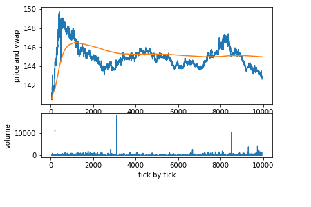
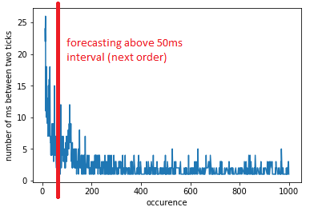

# Limit_order_ML

Introduction:

This project try to resove the problem of execution with low liquid stocks for intraday trading.
Indeed sweeping the book is often several times more expensive than the transaction fee itself.

Consequently, we try to use machine learning to forecast the next order going through the book.

Ideally the forecast is fast enough so we can play the market maker and get executed with our limit order, unfortunately, I also highly suspect once implemented live, market-makers would over-bid us every single time. 

The data:

I paid data from polygon.io and canceled tbe subscription right after during the free trial version

-First 10k tick by tick orders of the stocks the day following the earning (related to the other project with earnings)

Conclusion:

We get 75-80% accurate, which is pretty good but unsurprising. I also suspect non ML models based on momentum could achieve similar performances.

